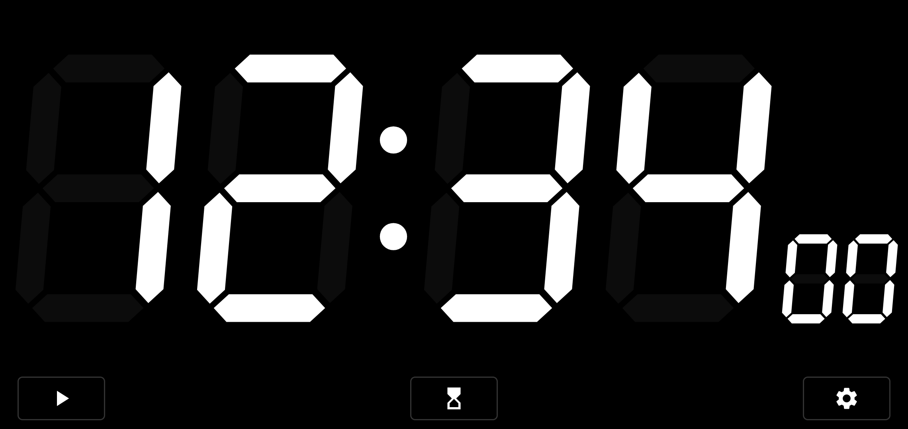

# Fullscreen Timer

[](./LICENSE)
[](https://github.com/ohmae/fullscreen-timer/releases)
[](https://github.com/ohmae/fullscreen-timer/issues)
[](https://github.com/ohmae/fullscreen-timer/issues?q=is%3Aissue+is%3Aclosed)



# Install

[Google Play](https://play.google.com/store/apps/details?id=net.mm2d.timer)

# Supported Languages

This app supports the following languages:

| Language | File Link |
| --- | --- |
| English (Default) | [values/strings.xml](./app/src/main/res/values/strings.xml) |
| Japanese (日本語) | [values-ja/strings.xml](./app/src/main/res/values-ja/strings.xml) |
| Spanish (Español) | [values-es/strings.xml](./app/src/main/res/values-es/strings.xml) |
| Portuguese (Português) | [values-pt/strings.xml](./app/src/main/res/values-pt/strings.xml) |
| Korean (한국어) | [values-ko/strings.xml](./app/src/main/res/values-ko/strings.xml) |
| Indonesian (Bahasa Indonesia) | [values-in/strings.xml](./app/src/main/res/values-in/strings.xml) |
| Arabic (العربية) | [values-ar/strings.xml](./app/src/main/res/values-ar/strings.xml) |
| Russian (Русский) | [values-ru/strings.xml](./app/src/main/res/values-ru/strings.xml) |
| Turkish (Türkçe) | [values-tr/strings.xml](./app/src/main/res/values-tr/strings.xml) |
| French (Français) | [values-fr/strings.xml](./app/src/main/res/values-fr/strings.xml) |
| German (Deutsch) | [values-de/strings.xml](./app/src/main/res/values-de/strings.xml) |
| Italian (Italiano) | [values-it/strings.xml](./app/src/main/res/values-it/strings.xml) |
| Chinese (Simplified) (简体中文) | [values-zh-rCN/strings.xml](./app/src/main/res/values-zh-rCN/strings.xml) |
| Chinese (Traditional) (繁體中文) | [values-zh-rTW/strings.xml](./app/src/main/res/values-zh-rTW/strings.xml) |
| Hindi (हिन्दी) | [values-hi/strings.xml](./app/src/main/res/values-hi/strings.xml) |
| Vietnamese (Tiếng Việt) | [values-vi/strings.xml](./app/src/main/res/values-vi/strings.xml) |
| Polish (Polski) | [values-pl/strings.xml](./app/src/main/res/values-pl/strings.xml) |
| Persian (فارسی) | [values-fa/strings.xml](./app/src/main/res/values-fa/strings.xml) |
| Ukrainian (Українська) | [values-uk/strings.xml](./app/src/main/res/values-uk/strings.xml) |
| Dutch (Nederlands) | [values-nl/strings.xml](./app/src/main/res/values-nl/strings.xml) |
| Thai (ไทย) | [values-th/strings.xml](./app/src/main/res/values-th/strings.xml) |
| Uzbek (Oʻzbekcha) | [values-uz/strings.xml](./app/src/main/res/values-uz/strings.xml) |
| Bengali (বাংলা) | [values-bn/strings.xml](./app/src/main/res/values-bn/strings.xml) |
| Urdu (اردو) | [values-ur/strings.xml](./app/src/main/res/values-ur/strings.xml) |

# Intent Control

This app accepts control by Intent from other apps.

## EXTRA_MODE (required type: String)

Specifies the app mode. Required. Ignored if not specified.

- CLOCK
- STOPWATCH
- TIMER

## EXTRA_COMMAND (type: String)

Specifies a command. There are the following variations. Ignored if MODE is CLOCK

- START
  - Changes to start state. Ignored if already started. If the count is progressing, it will continue.
- STOP
  - Changes to stop state. Ignored if already stoped. If the count is progressing, it will continue.
- SET
  - Sets the count to the specified value and changes to stop state. Specify the value in EXTRA_TIME. Therefore, EXTRA_TIME must be specified, otherwise this command will be ignored.
- SET_AND_START
  - Sets the count to the specified value and changes to start state. Specify the value in EXTRA_TIME. Therefore, EXTRA_TIME must be specified, otherwise this command will be ignored.

## EXTRA_TIME (type: Long)

Specifies the time when EXTRA_COMMAND is SET or SET_AND_START. Specify the time as a long value in milliseconds.

## Example

To start clock mode.

```kotlin
packageManager.getLaunchIntentForPackage("net.mm2d.timer")?.also {
    it.putExtra("EXTRA_MODE", "CLOCK")
}?.let {
    startActivity(it)
}
```

To start stopwatch mode and count up start from 0 seconds.

```kotlin
packageManager.getLaunchIntentForPackage("net.mm2d.timer")?.also {
    it.putExtra("EXTRA_MODE", "STOPWATCH")
    it.putExtra("EXTRA_COMMAND", "SET_AND_START")
    it.putExtra("EXTRA_TIME", 0L)
}?.let {
    startActivity(it)
}
```

To start timer mode and count down start from 2 minutes.

```kotlin
packageManager.getLaunchIntentForPackage("net.mm2d.timer")?.also {
    it.putExtra("EXTRA_MODE", "TIMER")
    it.putExtra("EXTRA_COMMAND", "SET_AND_START")
    it.putExtra("EXTRA_TIME", 120_000L)
}?.let {
    startActivity(it)
}
```

## Author

大前 良介 (OHMAE Ryosuke)
http://www.mm2d.net/

## License

[MIT License](./LICENSE)
